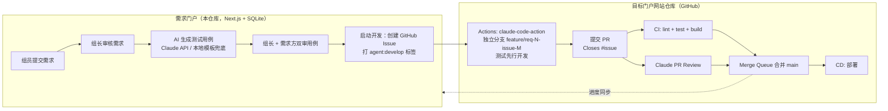

# 运维需求交付门户 — 设计文档

## 1. 目标

为按岗位分组（数据库组、中间件组、主机组、网络组，可扩展）的运维团队提供一条从
**需求收集 → 审核 → AI 生成测试用例 → 双方审核 → AI Agent 开发 → 测试 → CI/CD 集成部署**
的全自动化交付流水线，把开发人员从重复开发中解放出来。

## 2. 总体架构



## 3. 关键设计决策

### 3.1 需求独立性（防冲突）

- **一个需求 = 一个 Issue = 一个分支 = 一个 PR**，分支名 `feature/req-<门户需求ID>-issue-<Issue号>`，天然唯一。
- 目标仓库按小组划分模块目录（`modules/<team>/`），CLAUDE.md 中规定"新功能模块自包含、公共组件只增不改"，从源头减少跨需求文件冲突。
- 合并使用 **GitHub Merge Queue**（分支保护规则中开启）：PR 逐个在队列中基于最新 main 重新构建测试后合并，彻底避免 "green PR 合并后 main 变红" 和并发合并冲突。
- 比 "按天合并分支" 更优：粒度更细、可独立回滚、Issue/PR/需求一一对应可追溯。

### 3.2 复用开源，不造轮子

| 环节 | 复用方案 |
|------|----------|
| Agent 开发 / PR 审查 | [anthropics/claude-code-action](https://github.com/anthropics/claude-code-action)（官方 GitHub Action）|
| CI/CD | GitHub Actions + Merge Queue + 分支保护 |
| GitHub API | Octokit（官方 SDK）|
| 测试用例生成 | Anthropic SDK（Claude API）|
| Web 框架 | Next.js（App Router）+ Tailwind CSS |
| 存储 | Node.js 内置 `node:sqlite`，零外部依赖，本地开箱即用 |

门户本身只实现"胶水"：审批状态机 + 表单 + GitHub 编排，代码量刻意保持最小。

### 3.3 状态机（单一事实来源：`src/lib/workflow.ts`）

```
submitted ──组长通过──▶ requirement_approved ──生成──▶ testcases_generated
    │驳回                                                  │双审通过        │驳回
    ▼                                                      ▼               ▼
requirement_rejected（可重新审核）              testcases_approved   testcases_rejected（可重新生成）
                                                           │组长启动开发
                                                           ▼
                                    developing（Issue 已建，agent 开发中）
                                                           │PR 创建（同步）
                                                           ▼
                                                      in_review ──合并──▶ done
```

- 所有动作的 **前置状态 + 角色 + 附加校验** 集中声明在 `ACTION_RULES`，前后端共用，单元测试覆盖。
- 测试用例为**双审**：本组组长 + 需求提交人都通过才放行；提交人本人是组长时一次通过即可。
- 用例支持人工修订（修订后自动重置双方审批位）。

### 3.4 角色模型

- `member`（组员）：提交需求、审核自己提交需求的测试用例。
- `lead`（组长）：审核**本组**需求与测试用例、启动开发。
- `admin`：跨组全权限。
- 当前为演示登录（选账号进入），预留 `users` 表，生产接入 LDAP / SSO 时仅需替换 `src/lib/session.ts`。

### 3.5 Agent 开发环节（目标仓库侧）

`github-templates/` 下的三个 workflow 拷贝到门户网站仓库即可生效：

1. **agent-develop.yml**：Issue 被打上 `agent:develop` 标签时触发 claude-code-action，
   要求其"测试先行"——先把 Issue 中的验收用例转成自动化测试，再实现功能，最后建 PR。
2. **ci.yml**：PR / merge queue 上强制 lint + test + build（配 required status checks）。
3. **claude-pr-review.yml**：每个 PR 由 Claude 复核规范符合度与用例覆盖度。

开发规范承载在**每个目标仓库**根目录的 `agent.md`（模板见 `github-templates/agent.md.example`）；
仓库里再放一行引导文件 `CLAUDE.md` / `AGENTS.md` 指向 agent.md，即可同时兼容 Claude Code 与 Codex 的自动读取约定。

### 3.6 降级与容错

- 未配置 `ANTHROPIC_API_KEY`：测试用例退化为本地模板生成（核心场景逐条转用例 + 通用正常/边界/权限用例），流程不中断。
- 未配置 `GITHUB_TOKEN/GITHUB_REPO`：流程可走到 `testcases_approved`，"启动开发"时给出明确配置指引。
- GitHub 进度采用手动"同步"按钮拉取（轮询 Issue timeline / PR 状态）；生产可加 webhook 推送（预留 `sync_github` 动作即为幂等同步入口）。

## 4. 数据模型

- `requirements`：需求主体 + 状态 + 绑定仓库(repo) + 测试用例(JSON) + 双审标记 + GitHub 关联（issue/branch/pr）。
- `repos`：可绑定的目标仓库列表（组长/管理员在「仓库管理」页维护，或 GITHUB_REPOS 预置）。
- `events`：需求级审计时间线（谁、何时、做了什么）。
- `users`：演示账号（生产替换为 LDAP/SSO）。

## 5. 需求演进记录

### v2（2026-07-18）

1. **多仓库支持**：每个需求提交时必选绑定一个目标仓库（`owner/repo`）；
   仓库列表由组长/管理员在「设置 → 仓库管理」维护（或 `GITHUB_REPOS` 环境变量预置）；
   建 Issue / 同步 PR 进度均按需求绑定的仓库执行，全局共用一个 `GITHUB_TOKEN`。
2. **开发规范载体改为 `agent.md`**：每个目标仓库根目录维护 `agent.md`，
   Issue 开发约定、agent 开发指令、PR 审查标准均指向它；
   仓库内放一行引导文件 `CLAUDE.md` / `AGENTS.md` 指向 agent.md，同时兼容 Claude Code 与 Codex。
3. **账号与角色管理**：管理员在「设置 → 账号管理」增删账号、调整角色（组员/组长/管理员）与所属小组；
   安全规则：不能删除自己、必须至少保留一个管理员（`src/lib/user-admin.ts`，单元测试覆盖）。
   演示登录模式下新增账号即出现在登录页；接入 LDAP/SSO 后此页仍用于角色/小组授权。

### v3（2026-07-19）

1. **GitHub / GitLab OAuth 登录**：配置 `GITHUB_OAUTH_CLIENT_ID/SECRET` 或
   `GITLAB_OAUTH_CLIENT_ID/SECRET`（自建实例配 `GITLAB_URL`）后，登录页出现对应按钮；
   首次 OAuth 登录自动创建账号（组员 / 未分配小组），管理员在「账号管理」中绑定角色与小组，
   再次登录按 `provider + provider_login` 复用绑定关系；**内置账号登录始终保留**（演示/应急入口）。
   轻量自实现 OAuth2（authorize → code → token → user，state 防 CSRF），未引入额外框架。
2. **Agent 状态监控**：
   - 需求详情页新增「Agent 运行监控」卡片：拉取目标仓库中与该需求相关的 GitHub Actions 运行
     （按需求分支 + issues 事件标题匹配，`src/lib/agent-monitor.ts`，单元测试覆盖），30 秒自动刷新；
   - 检测到最近一次运行失败/取消/超时（`failed` 健康度）时给出醒目提示，
     组长可一键「重新触发开发」（摘掉再重打 `agent:develop` 标签，幂等重启 agent），避免中断后任务被遗忘；
   - 新增全局「Agent 监控」页：汇总所有开发中/审查中需求的健康度，失败置顶。
3. **工作台岗位筛选**：组员/组长为「只看本岗位」开关（按登录人所属小组过滤）；
   管理员不属于具体岗位，改为「选择岗位」下拉框（全部岗位 / 任一岗位）。均为 URL 参数驱动，可收藏/分享。
4. **小组升级为一等实体**：新增 `teams` 表与「设置 → 小组管理」页（仅管理员），
   账号归属、需求提交、工作台筛选统一从小组列表选择（下拉框，不可随意填写）；
   后端校验小组必须存在，被账号或需求引用的小组不能删除。

### v4（2026-07-19）：Agent 执行层改为本地 CLI

**背景**：`claude-code-action`（GitHub Actions 云端执行）走 Anthropic API 计费且需要 API Key；
团队实际使用的是本机已登录的 Claude Code / Codex 客户端（订阅额度）。

**新架构**（`src/lib/agent-runner.ts`）：

```
启动开发 → 建 Issue（追踪）→ 门户后端调度本地任务（agent_tasks 表）
  → 独立工作区 clone + 建分支（data/workspaces/req-N-task-M）
  → 生成提示词（需求 + 已审核用例 + agent.md 要求，测试先行）
  → 本地 CLI 执行：claude -p --dangerously-skip-permissions / codex exec --full-auto
  → runner 强制重跑仓库测试（不信任 agent 自述）→ 兜底提交 → push
  → Octokit 建 PR（Closes #issue）→ 需求转入 in_review
失败/超时（默认 30 分钟）→ 任务标记 failed → 门户红色告警 → 一键重新触发
```

- **引擎可插拔**：`ENGINES` 注册表（claude / codex），`/api/agent-engines` 探测本机安装情况；
  按需求粒度选择引擎（`start_dev`/`retrigger_dev` 的 `engine` 参数），默认 `AGENT_ENGINE`。
- **监控**：详情页「本地 Agent 任务」卡片（状态/步骤/实时日志，5 秒轮询）+
  原「GitHub Actions 监控」卡片（CI/审查）；服务重启后的孤儿任务按 pid 探活判定失败。
- **GitHub 侧职责收缩**：Issue 追踪 + CI（`ci.yml`，无需任何 Key）+ Merge Queue 合并；
  云端 `agent-develop.yml` / `claude-pr-review.yml` 模板保留，供有 API Key 的团队选用（两种模式可并存）。

## 6. 后续演进

- GitHub Webhook 替代手动同步；企业微信/钉钉通知审批人。
- 需求与 GitHub Projects 看板双向同步。
- Codex 支持：目标仓库同时维护 AGENTS.md，workflow 中按标签选择 agent。
