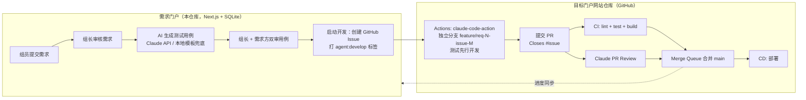

# 运维需求交付门户 — 设计文档

## 1. 目标

为按岗位分组（数据库组、中间件组、主机组、网络组，可扩展）的运维团队提供一条从
**需求收集 → 审核 → AI 生成测试用例 → 双方审核 → AI Agent 开发 → 测试 → CI/CD 集成部署**
的全自动化交付流水线，把开发人员从重复开发中解放出来。

## 2. 总体架构



## 3. 关键设计决策

### 3.1 需求独立性（防冲突）

- **一个需求 = 一个 Issue = 一个分支 = 一个 PR**，分支名 `feature/req-<门户需求ID>-issue-<Issue号>`，天然唯一。
- 目标仓库按小组划分模块目录（`modules/<team>/`），CLAUDE.md 中规定"新功能模块自包含、公共组件只增不改"，从源头减少跨需求文件冲突。
- 合并使用 **GitHub Merge Queue**（分支保护规则中开启）：PR 逐个在队列中基于最新 main 重新构建测试后合并，彻底避免 "green PR 合并后 main 变红" 和并发合并冲突。
- 比 "按天合并分支" 更优：粒度更细、可独立回滚、Issue/PR/需求一一对应可追溯。

### 3.2 复用开源，不造轮子

| 环节 | 复用方案 |
|------|----------|
| Agent 开发 / PR 审查 | [anthropics/claude-code-action](https://github.com/anthropics/claude-code-action)（官方 GitHub Action）|
| CI/CD | GitHub Actions + Merge Queue + 分支保护 |
| GitHub API | Octokit（官方 SDK）|
| 测试用例生成 | Anthropic SDK（Claude API）|
| Web 框架 | Next.js（App Router）+ Tailwind CSS |
| 存储 | Node.js 内置 `node:sqlite`，零外部依赖，本地开箱即用 |

门户本身只实现"胶水"：审批状态机 + 表单 + GitHub 编排，代码量刻意保持最小。

### 3.3 状态机（单一事实来源：`src/lib/workflow.ts`）

```
submitted ──组长通过──▶ requirement_approved ──生成──▶ testcases_generated
    │驳回                                                  │双审通过        │驳回
    ▼                                                      ▼               ▼
requirement_rejected（可重新审核）              testcases_approved   testcases_rejected（可重新生成）
                                                           │组长启动开发
                                                           ▼
                                    developing（Issue 已建，agent 开发中）
                                                           │PR 创建（同步）
                                                           ▼
                                                      in_review ──合并──▶ done
```

- 所有动作的 **前置状态 + 角色 + 附加校验** 集中声明在 `ACTION_RULES`，前后端共用，单元测试覆盖。
- 测试用例为**双审**：本组组长 + 需求提交人都通过才放行；提交人本人是组长时一次通过即可。
- 用例支持人工修订（修订后自动重置双方审批位）。

### 3.4 角色模型

- `member`（组员）：提交需求、审核自己提交需求的测试用例。
- `lead`（组长）：审核**本组**需求与测试用例、启动开发。
- `admin`：跨组全权限。
- 当前为演示登录（选账号进入），预留 `users` 表，生产接入 LDAP / SSO 时仅需替换 `src/lib/session.ts`。

### 3.5 Agent 开发环节（目标仓库侧）

`github-templates/` 下的三个 workflow 拷贝到门户网站仓库即可生效：

1. **agent-develop.yml**：Issue 被打上 `agent:develop` 标签时触发 claude-code-action，
   要求其"测试先行"——先把 Issue 中的验收用例转成自动化测试，再实现功能，最后建 PR。
2. **ci.yml**：PR / merge queue 上强制 lint + test + build（配 required status checks）。
3. **claude-pr-review.yml**：每个 PR 由 Claude 复核规范符合度与用例覆盖度。

开发规范承载在**每个目标仓库**根目录的 `agent.md`（模板见 `github-templates/agent.md.example`）；
仓库里再放一行引导文件 `CLAUDE.md` / `AGENTS.md` 指向 agent.md，即可同时兼容 Claude Code 与 Codex 的自动读取约定。

### 3.6 降级与容错

- 未配置 `ANTHROPIC_API_KEY`：测试用例退化为本地模板生成（核心场景逐条转用例 + 通用正常/边界/权限用例），流程不中断。
- 未配置 `GITHUB_TOKEN/GITHUB_REPO`：流程可走到 `testcases_approved`，"启动开发"时给出明确配置指引。
- GitHub 进度采用手动"同步"按钮拉取（轮询 Issue timeline / PR 状态）；生产可加 webhook 推送（预留 `sync_github` 动作即为幂等同步入口）。

## 4. 数据模型

- `requirements`：需求主体 + 状态 + 绑定仓库(repo) + 测试用例(JSON) + 双审标记 + GitHub 关联（issue/branch/pr）。
- `repos`：可绑定的目标仓库列表（组长/管理员在「仓库管理」页维护，或 GITHUB_REPOS 预置）。
- `events`：需求级审计时间线（谁、何时、做了什么）。
- `users`：演示账号（生产替换为 LDAP/SSO）。

## 5. 需求演进记录

### v2（2026-07-18）

1. **多仓库支持**：每个需求提交时必选绑定一个目标仓库（`owner/repo`）；
   仓库列表由组长/管理员在「设置 → 仓库管理」维护（或 `GITHUB_REPOS` 环境变量预置）；
   建 Issue / 同步 PR 进度均按需求绑定的仓库执行，全局共用一个 `GITHUB_TOKEN`。
2. **开发规范载体改为 `agent.md`**：每个目标仓库根目录维护 `agent.md`，
   Issue 开发约定、agent 开发指令、PR 审查标准均指向它；
   仓库内放一行引导文件 `CLAUDE.md` / `AGENTS.md` 指向 agent.md，同时兼容 Claude Code 与 Codex。
3. **账号与角色管理**：管理员在「设置 → 账号管理」增删账号、调整角色（组员/组长/管理员）与所属小组；
   安全规则：不能删除自己、必须至少保留一个管理员（`src/lib/user-admin.ts`，单元测试覆盖）。
   演示登录模式下新增账号即出现在登录页；接入 LDAP/SSO 后此页仍用于角色/小组授权。

### v3（2026-07-19）

1. **GitHub / GitLab OAuth 登录**：配置 `GITHUB_OAUTH_CLIENT_ID/SECRET` 或
   `GITLAB_OAUTH_CLIENT_ID/SECRET`（自建实例配 `GITLAB_URL`）后，登录页出现对应按钮；
   首次 OAuth 登录自动创建账号（组员 / 未分配小组），管理员在「账号管理」中绑定角色与小组，
   再次登录按 `provider + provider_login` 复用绑定关系；**内置账号登录始终保留**（演示/应急入口）。
   轻量自实现 OAuth2（authorize → code → token → user，state 防 CSRF），未引入额外框架。
2. **Agent 状态监控**：
   - 需求详情页新增「Agent 运行监控」卡片：拉取目标仓库中与该需求相关的 GitHub Actions 运行
     （按需求分支 + issues 事件标题匹配，`src/lib/agent-monitor.ts`，单元测试覆盖），30 秒自动刷新；
   - 检测到最近一次运行失败/取消/超时（`failed` 健康度）时给出醒目提示，
     组长可一键「重新触发开发」（摘掉再重打 `agent:develop` 标签，幂等重启 agent），避免中断后任务被遗忘；
   - 新增全局「Agent 监控」页：汇总所有开发中/审查中需求的健康度，失败置顶。
3. **工作台岗位筛选**：组员/组长为「只看本岗位」开关（按登录人所属小组过滤）；
   管理员不属于具体岗位，改为「选择岗位」下拉框（全部岗位 / 任一岗位）。均为 URL 参数驱动，可收藏/分享。
4. **小组升级为一等实体**：新增 `teams` 表与「设置 → 小组管理」页（仅管理员），
   账号归属、需求提交、工作台筛选统一从小组列表选择（下拉框，不可随意填写）；
   后端校验小组必须存在，被账号或需求引用的小组不能删除。

### v4（2026-07-19）：Agent 执行层改为本地 CLI

**背景**：`claude-code-action`（GitHub Actions 云端执行）走 Anthropic API 计费且需要 API Key；
团队实际使用的是本机已登录的 Claude Code / Codex 客户端（订阅额度）。

**新架构**（`src/lib/agent-runner.ts`）：

```
启动开发 → 建 Issue（追踪）→ 门户后端调度本地任务（agent_tasks 表）
  → 独立工作区 clone + 建分支（data/workspaces/req-N-task-M）
  → 生成提示词（需求 + 已审核用例 + agent.md 要求，测试先行）
  → 本地 CLI 执行：claude -p --dangerously-skip-permissions / codex exec --full-auto
  → runner 强制重跑仓库测试（不信任 agent 自述）→ 兜底提交 → push
  → Octokit 建 PR（Closes #issue）→ 需求转入 in_review
失败/超时（默认 30 分钟）→ 任务标记 failed → 门户红色告警 → 一键重新触发
```

- **引擎可插拔**：`ENGINES` 注册表（claude / codex），`/api/agent-engines` 探测本机安装情况；
  按需求粒度选择引擎（`start_dev`/`retrigger_dev` 的 `engine` 参数），默认 `AGENT_ENGINE`。
- **监控**：详情页「本地 Agent 任务」卡片（状态/步骤/实时日志，5 秒轮询）+
  原「GitHub Actions 监控」卡片（CI/审查）；服务重启后的孤儿任务按 pid 探活判定失败。
- **GitHub 侧职责收缩**：Issue 追踪 + CI（`ci.yml`，无需任何 Key）+ Merge Queue 合并；
  云端 `agent-develop.yml` / `claude-pr-review.yml` 模板保留，供有 API Key 的团队选用（两种模式可并存）。

### v5（2026-07-19）：执行方案智能评估

- 「用例审核通过」后、启动开发前，组长可点「🤖 AI 评估」：门户调用本地 Claude Code
  （小模型 `AGENT_EVAL_MODEL`，默认 haiku，约 10-20 秒）根据任务内容评估执行方案——
  **用哪个引擎（claude/codex）、什么模型、什么推理强度（low/medium/high）**，并给出一句话理由。
- 评估结果显示在启动面板中，三项均为下拉框**可人工修改**，最终以启动时的选择为准
  （方案来源标记 ai / manual / default，全程记入时间线）。
- AI 输出经 `sanitizePlan` 校验兜底：引擎必须已安装、模型必须在引擎清单内、非法值回退默认；
  评估调用失败自动回退默认方案，不阻塞流程。
- 推理强度落地：claude 用 `MAX_THINKING_TOKENS`（16000/31999），codex 用 `model_reasoning_effort`。
- 重新触发沿用已保存方案；任务卡片展示实际使用的引擎/模型/强度。

### v6（2026-07-19）：Codex 承担用例生成与 PR 审查

AI 环节全景（均为本地 CLI，不依赖云端 API Key）：

| 环节 | 引擎 | 说明 |
|------|------|------|
| 测试用例生成 | **Codex**（默认） | 兜底链：codex → Anthropic API（若配 Key）→ 本地模板 |
| 执行方案评估 | Claude（haiku） | 推荐引擎/模型/推理强度，人工可改 |
| 需求开发 | Claude / Codex | 按执行方案调度 |
| PR 代码审查 | **Codex**（默认） | 与开发引擎交叉互审，避免同模型自审 |

- PR 审查：开发任务建完 PR 后**自动触发**（`AGENT_AUTO_REVIEW=0` 关闭），组长也可在详情页手动
  「🧐 发起/重新审查」；审查在独立工作区 checkout PR 分支，按 agent.md + 验收用例逐条核对，
  结论（✅ 建议合并 / ⚠️ 建议修改 + 分条建议）自动评论到 PR 并展示在门户任务卡片中。
- `agent_tasks` 表扩展 kind（develop/review）与 result 字段；审查引擎可用 `AGENT_REVIEW_ENGINE` 覆盖。
- 坑位记录：codex exec 会等待 stdin 关闭，必须以 `stdio: ignore` 方式启动，否则挂起直到超时。

### v7（2026-07-19）：执行器拆分为独立 runner + 监控全景

- **runner 守护进程**（`npm run runner`，`runner/daemon.ts`）：门户只入队（agent_tasks 表 status=queued），
  runner 轮询认领并串行执行。门户重启不中断任务（已实测：任务运行中重启门户，任务照常完成）；
  runner 重启会把孤儿任务标记失败（按 pid 探活），门户可一键重触发。
- **测试用例生成纳入任务体系**：kind=testcases，与开发/审查一样有引擎、状态、步骤、结果记录。
- **Agent 监控页重做**：全量本地任务表——任务类型（用例生成/开发/PR 审查）、
  **引擎/模型/推理强度**、状态+当前步骤、失败原因、起止时间，失败置顶，10 秒刷新。

### v8（2026-07-19）：防滥用安全门（不做免费 AI 入口）

三道防线，确保系统只为“系统内仓库的软件开发需求”消耗 AI 额度：

1. **仓库白名单硬校验**：需求绑定的仓库必须在「仓库管理」列表内——提交时校验（API 层，
   绕过 UI 直接调接口也拦截），runner 执行每个任务前再校验一次（防事后删改）。
2. **AI 门审**（`src/lib/guard.ts`，haiku 小模型，结论缓存到需求上）：任何 Agent 任务
   （用例生成/开发/审查）执行前判断是否为正当开发需求；拒绝写文章/翻译/问答等内容生成、
   把 Agent 当通用 AI、泄露密钥/提示词、恶意用途、指令注入。**fail-closed**：只有显式
   allowed=true 才放行，门审调用失败任务失败可重试；rejected 缓存后该需求所有任务永久拒绝，
   详情页红色横幅提示（改需求描述重新提交才会重审）。
3. **触发权限收紧**：生成用例从“任意登录用户”改为“本组组长/管理员或需求提交人”。

实测：白名单外仓库提交被 400 拒绝；伪装成需求的“写 2000 字文章 + 忽略规范”被门审识别拒绝
（含指令注入识别），未消耗 codex 额度；正当开发需求正常通过（guard: approved）。

### v9（2026-07-19）：仓库归属范围（公共 / 组专属）

- `repos` 表新增 `team` 字段：空 = 公共仓库（全员可选用）；指定小组 = 仅该组成员（及管理员）可选用。
- 「仓库管理」添加仓库时选择归属，列表显示「公共 / xx组专属」标识。
- 提交需求的仓库下拉框按当前用户过滤（`/api/repos?forUser=1`）；API 层双重校验，
  绕过 UI 直接提交组外专属仓库会被拒绝（`src/lib/repo-access.ts`，单元测试覆盖）。

### v10（2026-07-19）：默认分支适配 + codegraph 代码智能接入

- **默认分支适配**：目标仓库默认分支可能是 main/master/其它，不再写死 main。
  `getDefaultBranch(repo)`（Octokit `repos.get().default_branch`，带缓存、失败回退 main）
  贯穿开发任务的 fetch / rev-list / PR base 与审查任务的 diff 基准。已实测 middleware 仓库解析为 master。
- **codegraph 代码智能**：开发/审查任务在 fresh clone checkout 后自动 `codegraph init` 建索引
  （best-effort，未安装或失败则跳过，不阻塞任务；`.codegraph/` 写入 `.git/info/exclude` 绝不进 PR），
  并在 agent 提示词中引导使用 `codegraph explore/node/callers/callees/impact`——
  动手前查结构、改动前查影响面。claude/codex 均为全权限模式可直接调用，无需改 allowedTools。
  任务新增「建代码索引」步骤。踩坑：fresh clone 上必须用 `codegraph init`（`index` 需已初始化）。

### v11（2026-07-19）：仓库入驻（onboarding）

仓库加入门户时一次性完成"分析建库"，而非每个任务临时抱佛脚：

- **入驻流程**（后台异步，runner 优先处理）：加仓库置 `pending` → runner 认领 →
  ① 服务器建**持久镜像 clone + codegraph 索引**（`data/repos/<repo>/`）
  ② 用本地 agent（`AGENT_ONBOARD_ENGINE`，默认 claude，借助 codegraph 理解代码）**分析生成/补齐 agent.md**：
  仓库已有则检查是否覆盖必备章节、缺则补；无则从零生成 → 通过 GitHub API 开 PR（不覆盖、不直推）
  → 置 `ready`。
- **门禁**：仓库 `ready` 前 `start_dev` 被拒（"仓库正在入驻中"），入驻失败提示重新入驻。
- **索引复用**：开发/审查任务不再每次全量 `init`，而是**拷贝镜像的 `.codegraph/` + `codegraph sync`**（增量，快）；
  无镜像时回退全量 init。已实测拷贝+sync 后查询正常。
- **UI**：仓库管理显示入驻状态（就绪/待入驻/入驻中·步骤/失败）、agent.md PR 链接、重新入驻按钮，入驻中自动刷新。
- 老仓库迁移默认 `ready`（不强制重入驻）；新加仓库自动 `pending`。

### v12（2026-07-19）：改名 + 真实账密登录

- **项目改名**：运维需求交付门户 → **集成中心需求交付门户**（标题、页头、Logo「集」、生成提示等）。
- **真实账密登录**：内置账号改为用户名 + 密码登录（scrypt + 随机盐哈希，`src/lib/password.ts`，单测覆盖）。
  首次启动/迁移给内置账号设默认密码 `portal123`（`DEFAULT_PASSWORD` 可覆盖）；老库自动补密码列并回填。
  登录接口不再暴露用户列表（安全）。账号管理支持设初始密码与重置密码；第三方账号不设密码走 OAuth。
- **第三方登录图标**：登录页恒显示 GitHub / GitLab 图标按钮；已配置 OAuth 则可点击登录，未配置则禁用标「即将开放」，便于后期拓展。

### v13（2026-07-19）：任务可靠性加固 + 实时进度

保证前端任务状态可信、长任务/执行器宕机可检测：

- **runner 心跳**：runner 每 5 秒写全局心跳 + 给 running 任务打活性戳（`meta.runner_beat`、`agent_tasks.beat_at`）。
  即使某任务子进程在等待，心跳仍跳动（工作在子进程，事件循环不阻塞）；runner 一宕机心跳即冻结。
- **失联检测**：心跳超 20 秒判定执行器离线。接口据此计算任务「有效状态」——
  `running` 但（子进程已死 或 执行器离线）→ 判为**中断失败**，不再永久假显示"运行中"。
  这补上了此前用例生成/入驻等**无子进程 pid 的进程内任务在 runner 宕机时无法检测**的盲区。
- **自愈**：runner 启动时 `failStaleRunningTasks`（中断任务标失败）+ `resetStuckOnboarding`（卡在 indexing 的仓库重新入队）。
- **全局指示灯**：页头常驻「执行器在线/离线」指示灯（`/api/runner`，8 秒轮询）。
- **实时进度**：详情页任务卡片显示「最新进度」行（日志尾部最后一条 + 步骤 + 最后活动 Xs 前，滚动更新），
  开发/审查/用例生成三类任务通用；执行器离线时醒目提示。
- 附带修复：eslint/vitest 排除 `data/`（内含 clone 的目标仓库压缩 JS）。

### v14（2026-07-19）：开发↔审查自动迭代闭环

此前审查判「建议修改」后没有回路——「重新触发」是从 main 全新重做，既丢失已有工作也不带审查意见。现闭环：

- **解析审查结论**：`parseReviewVerdict`（首行「建议合并」→approved / 「建议修改」→changes，单测覆盖），
  结论与意见存到需求（`review_verdict` / `review_feedback` / `fix_rounds`）。
- **自动修复回路**：审查判 changes 且未达上限 → 自动入队一个「修复迭代」开发任务（沿用需求原执行方案的引擎/模型/强度）：
  - 该任务**基于既有分支**（`checkout -B <branch> origin/<branch>`）而非从 main 重做，保留已有实现；
  - 提示词带上**上一轮审查意见**，要求逐条修改、测试先行、不推倒重来；
  - 完成后 push（更新同一 PR）→ 自动复审 → 若仍 changes 继续，直到「建议合并」或达 `AGENT_MAX_FIX_ROUNDS`（默认 3）。
- **上限保护**：达上限则停止并记事件「请人工介入」；`AGENT_AUTO_FIX=0` 可关闭自动、仅保留人工触发。
- **门户可见**：详情页显示审查结论（建议合并/修改）+ 已自动修复轮次；任务卡片新增「按审查意见修复」步骤。
- `start_dev` 开启新开发周期时重置闭环状态。

### v15（2026-07-19）：每项目共享工作区（串行复用）

runner 全局串行执行，故同一项目的所有任务（开发/修复/审查/入驻）**共享一个工作区**
（`data/repos/<repo>`），而非每任务重新 clone：

- **`prepareRepoWorkspace`**：首次全量 clone（含所有分支，`origin/<分支>` ref 齐全，根治此前浅克隆 checkout 报 git 128 的问题）；
  之后每次任务前 `reset --hard + clean -fd`（保留被忽略的 `.codegraph/`、`node_modules/` 加速）→ 切目标分支 → codegraph 增量 `sync`。
- **收益**：不再每任务重 clone 大仓库（middleware 每轮省数分钟）；codegraph 索引持久复用；
  修复迭代天然基于既有分支（配合 v14 闭环）；杜绝旧的 per-task 工作区磁盘泄漏（实测清出 16 个目录、408MB）。
- 统一了 codegraph 镜像与工作区（一处 clone 一份索引）；`prepareWorkspaceIndex`（拷贝式）与 `buildMirrorIndex` 移除。
- 串行是前提（runner 单线程）；后期若要并行执行，需按分支/需求隔离工作区再改。

### v16（2026-07-19）：审查分级 + 模型清单实测更新

- **审查建议分级**：审查输出契约改为首行 `[阻断] 建议修改` / `[通过] 建议合并`，每条发现以【阻断】/【建议】开头。
  - 【阻断】= 功能不正确/用例未覆盖/测试未过/安全/破坏现有功能/严重违规——才触发自动修复循环；
  - 【建议】= 风格/命名/可读性/主观偏好——**不阻断合并、不触发循环**（此前非阻断 nitpick 也会烧掉修复轮次）。
  - `parseReviewVerdict` 标签优先解析 + 自由文本兜底；修复提示词明确「阻断必须解决，建议项不扩大改动面」。
- **模型清单实测更新**（经网关/CLI 逐一验证）：claude 默认加入 **claude-fable-5**（最新，Claude 5 系）；
  codex 网关实测可用 **gpt-5.6 / gpt-5.6-sol / gpt-5.5 / gpt-5.4**（gpt-5.3-codex 503、gpt-5.5-codex 404），默认清单与 .env 相应更新。
- middleware_resource_manager 主线切换：`feature/ops-agent`（领先 314 提交）强推为 master（旧 master 备份于 tag `backup/master-20260719`），
  过时 PR/分支清理，仓库按新主线**全量重新入驻**（删旧工作区与旧索引，全新 clone + codegraph init + agent.md 重生成）。

### v17（2026-07-19）：需求附件 + 前端渲染图 + 按钮防重 + 额度降级 + claude 流式进度

- **需求附件**：提交需求可上传图片/文档附件（≤15MB/个，≤20 个；详情页可补传/删除，图片缩略预览）。
  附件在开发任务时自动拷入工作区 `.portal-attachments/`（git 排除），agent 可直接查看设计图。
- **前端渲染图**：需求提交后自动入队 mockup 任务（先过防滥用门审）——AI 判定是否前端需求：
  非前端输出 SKIP；前端则生成单文件 HTML 原型（内联 CSS、模拟数据），评审时详情页 iframe（sandbox）预览、
  可新窗口打开、可重新生成。渲染原型也会随附件带给开发 agent 参考。
- **按钮防重**：详情页统一轮询任务活跃状态，启动开发/重触发/生成用例/审查/渲染图按钮在对应任务
  排队或运行中一律禁用（API 层 assertNoActiveTask 双保险）。
- **额度自动降级（启动选项）**：执行方案卡片新增复选框「额度受限时自动切换备用引擎重试」（默认开）；
  开发任务遇 session limit / rate limit / 429 类失败时自动用备用引擎（claude⇄codex）重跑一次（只切一次防来回横跳）。
- **claude 流式进度**：claude 开发/修复任务改用 `--output-format stream-json --verbose`，
  过程实时写日志；进度接口把 JSON 事件流转译成人类可读（🔧 工具调用/💬 输出/✅ 完成），前端「最新进度」实时可见。

### v18（2026-07-19）：需求废弃与拆解重提（多轮修复未过的人工闭环）

三轮自动修复仍未过审查 = 需求偏大，应当拆解。此前 fix_maxed 只能停在原地，现给出明确出口：

- **废弃（abandoned）**：新增终态。组长在任何未完成状态可废弃（填原因）；自动清理 GitHub
  （关闭 PR 不合并、删除分支、评论并以 not_planned 关闭 Issue）；废弃后一切动作封禁；
  看板归入「已驳回/已终止」折叠区，标注废弃原因。
- **拆解重提**：fix_maxed 横幅与废弃提示中提供「✂️ 拆解重提」——跳转新建需求页并预填原需求的
  标题/小组/仓库/描述/场景（描述头部自动注明"拆解自需求 #N"），拆小修改后作为新需求重新走全流程。
- 这同时消解了"周期隔离"问题：重跑不再复用旧需求，而是产生带干净时间线的新需求。

### v19（2026-07-19）：驳回后修改重提 + 重新生成附带补充要求

- **需求修改与重提**：待审核（submitted）状态提交人/组长可直接修改需求内容；
  **被驳回（requirement_rejected）状态修改保存后自动重新提交审核**（清驳回原因、重置安全门审结论、
  自动重新生成渲染图）。详情页需求卡片提供「✏️ 修改需求」内联编辑器（标题/小组/仓库/优先级/描述/场景）。
- **重新生成附带补充要求**：测试用例与前端渲染图的（重新）生成按钮支持输入补充要求
  （如"增加并发场景用例""改为深色主题"），要求存入任务（agent_tasks.extra）并注入生成提示词，
  事件记录附带的要求内容。

### v20（2026-07-20）：一仓一 token + 多主机（GitLab 主仓库）接入

- **每仓库专用访问令牌（一仓一 token）**：添加/管理仓库时可为该仓库绑定专用 PAT，用于
  clone/push。令牌只存库不回传前端（`repos.token`，接口只暴露 `hasToken` 布尔），
  留空则回退全局 `GITHUB_TOKEN`。仓库列表支持「设置/更新 token」。
- **多主机支持**：新增 `repos.host`，可指向 github.com 或自建 GitLab（可带 `http://` 前缀，
  兼容 HTTP-only 的内网 GitLab）。`cloneUrl` 按主机选择协议与用户名
  （GitHub=x-access-token / GitLab=oauth2）。默认分支探测改为主机无关：
  非 github 用 `git ls-remote --symref` 读取远程 HEAD，避免写死 main 在 master 仓库失败。
### v21（2026-07-20）：GitLab 全链路适配 + 添加仓库选托管类型

- **代码托管提供方抽象**：新增 `src/lib/repo-provider.ts` façade，按仓库 `provider`
  （github / gitlab）分派到 `github.ts`（Octokit）或 `gitlab.ts`（GitLab REST v4）。
  上层（actions 路由、`agent-runner`、`onboard`）只依赖 façade，不再直接耦合 Octokit。
  统一的高层接口：`getDefaultBranch / createIssueForRequirement / createOrGetPullRequest /
  postPrComment / openDocsPr / listAgentRuns / mergePullRequest / abandonOnGithub / syncIssueState`。
- **GitLab 适配层（`gitlab.ts`）**：Issue、MR（建/复用/评论/合并/关闭）、流水线状态、
  分支+多文件提交开 MR（agent.md 入驻）、Issue↔MR 状态同步，全部对接 GitLab REST API v4。
  认证用一仓一 token（或 `ZGL_TOKEN` 兜底）。
- **反代 %2F 兼容**：不少反代（Apache `AllowEncodedSlashes off`）会拦截路径中的编码斜杠，
  故一律用 `search` 解析并缓存**数字 project id**，避免 `/projects/:path%2F...`；含斜杠的分支
  一律走请求体传名，不用「按名删分支」（合并时靠 `remove_source_branch` 自动删）。
- **添加仓库选类型**：表单新增「类型」选择（GitHub / 自建 GitLab）。选 GitLab 时必填自建域名
  与专用令牌；GitHub 固定 `github.com`、令牌可选（回退全局）。列表按 provider 显示徽章。
- 新增 `repos.provider` 列（迁移时按 host 回填），凭据校验改为 `providerConfigured(repo)`。

## 6. 后续演进

- GitHub Webhook 替代手动同步；企业微信/钉钉通知审批人。
- 需求与 GitHub Projects 看板双向同步。
- Codex 支持：目标仓库同时维护 AGENTS.md，workflow 中按标签选择 agent。
